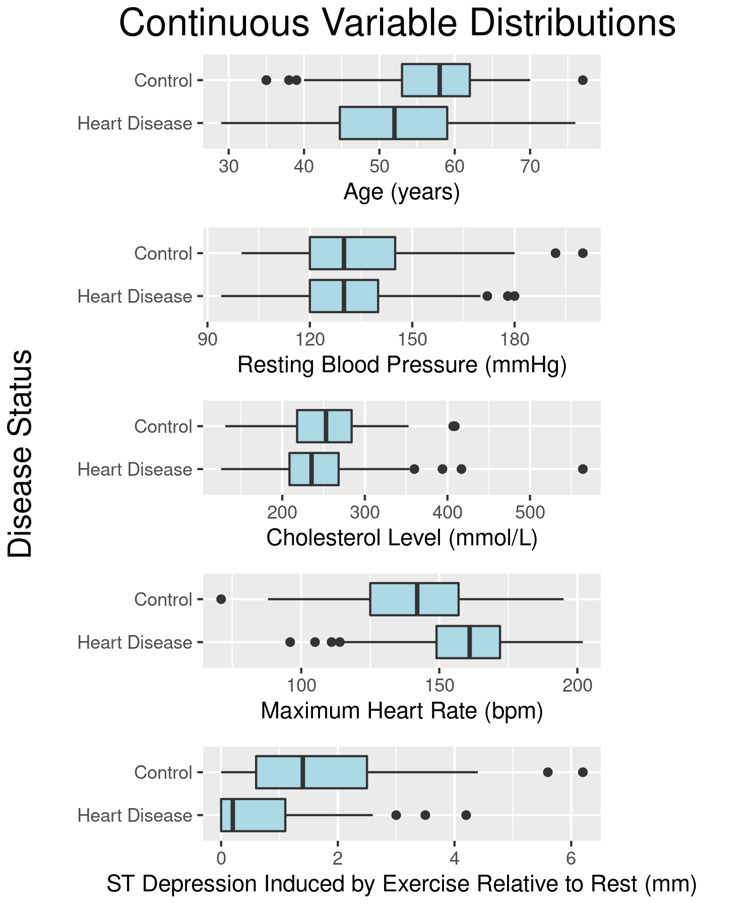
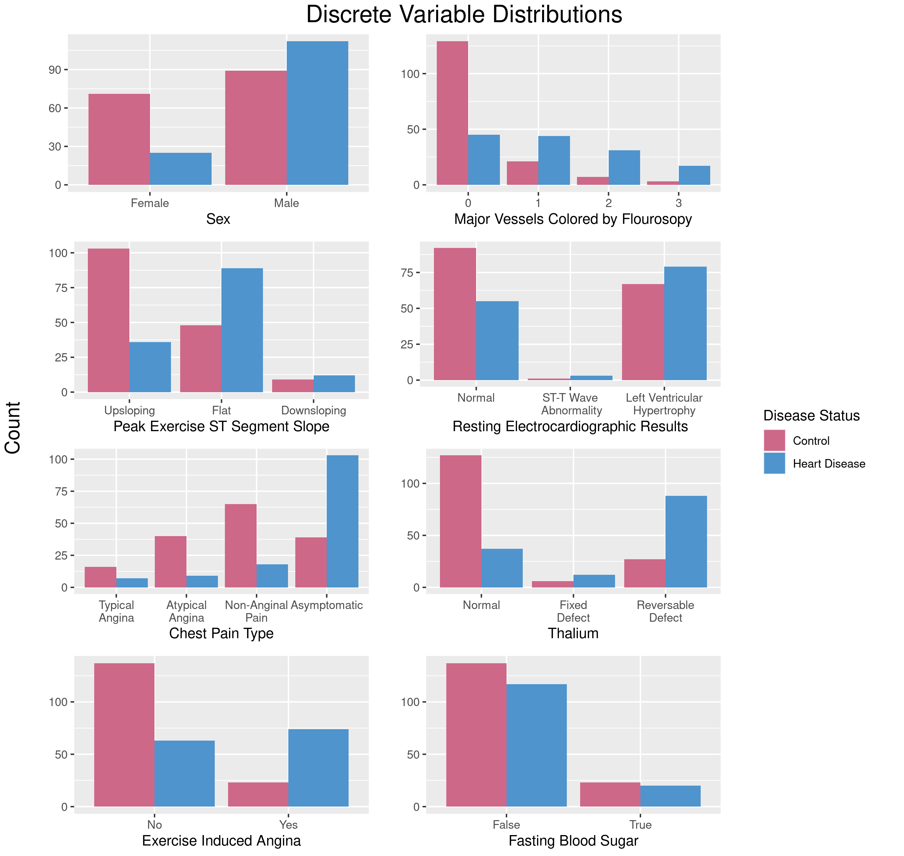

BIOS 611 Project 1
=======================
Heart Disease Dataset - Proposal
-----------------------

### Introduction
Heart Disease is a broad term that can be applied to many heart conditions that negatively impact heart health.  These complications can arise from a variety of factors, including genetics, environment, and unhealthy habits ^1^.  Individuals with heart disease are at a greater risk for heart attacks and heart failure ^2^.    

Finding indicators of heart disease can aid doctors in indentifying at risk individuals who need to be placed on preventative treatment. Are there certain demographic information and tests that accurately indicate the prevalence of heart disease in patients?  Which of these indicators have the most weight in determining heart disease status?  Can a model be created to accurately predict whether a patient has heart disease based on medical test records?

### Dataset
The heart disease data used in this project is publicly available from UC Irvine at 
https://archive.ics.uci.edu/ml/datasets/heart+Disease.  There are thirteen explanatory variables detailing patient demographics (sex, age) and heart test measurements (chest pain, cholesterol levels, etc.).  The response variable, heart disease, indicates the presence of heart disease in a patient.  The original dataset contains measurements on 303 patients.  For this analysis, 6 patients were removed for having missing values. After filtering, there are 160 patients without heart disease and 137 patients with heart disease.    

I plan on performing a regression analysis to identify which variables are most useful in predicting heart disease in patients. I will also build a machine learning model using this heart disease data that could be used to predict the prevalence of heart disease in future patients.  At the completion of this analysis, this repository will contain the interpreted regression results and the finalized machine learning model. 

### Preliminary Figures

The above boxplots illustrate the distributions of the continuous variables in the heart disease dataset.  The two categories with the greatest difference between cases and controls are Maximum Heart Rate and ST Depression Induced by Exercise Relative to Rest.

The bar charts displayed above provide a quick summary of the prevalence of each categorical variable level, separated by disease status.

### Usage
You'll need Docker and the ability to run Docker as your current user.

You'll need to build the container:

    > docker build . -t project1-env

This Docker container is based on rocker/verse. To run rstudio server:

    > docker run -v `pwd`:/home/rstudio -p 8787:8787\-e PASSWORD=mypassword -t project1-env
      
Then connect to the machine on port 8787.

On the command line:

    > docker run -v `pwd`:/home/rstudio -e PASSWORD=some_pw -it l6 sudo -H -u rstudio /bin/bash -c "cd ~/; R"
    
Or to run Bash:

    > docker run -v `pwd`:/home/rstudio -e PASSWORD=some_pw -it l6 sudo -H -u rstudio /bin/bash -c "cd ~/; /bin/bash"

Makefile
===========

The Makefile is an excellent place to look to get a feel for the project.

To build figures relating to the distribution of continuous heart variable distributions, for example, enter Bash either via the above incantation or with Rstudio and say:

    > make figures/cont_var_distributions.png 

### Information About Heart Disease
^1^ https://www.mayoclinic.org/diseases-conditions/heart-disease/symptoms-causes/syc-20353118  
^2^ https://www.cdc.gov/heartdisease/about.htm